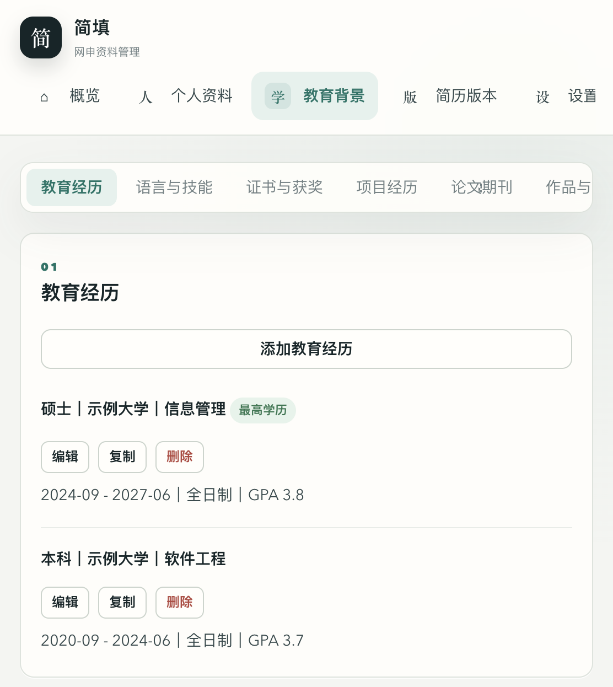
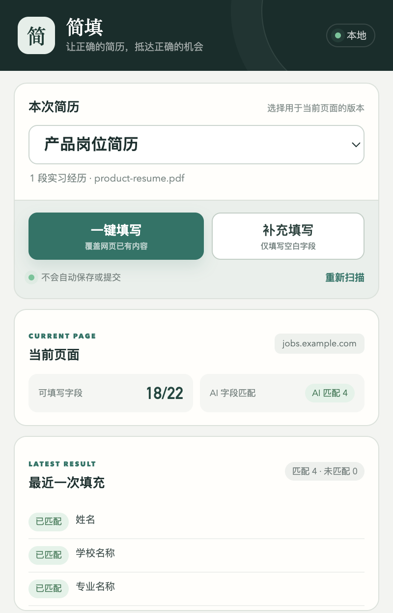

# 简填

简填是一个本地优先的 Chrome / Edge 网申辅助扩展，用于管理多版本简历并填写招聘网站表单。扩展不会自动保存、提交或投递，填写后仍需用户检查。

## 界面预览

截图使用虚构演示数据，不包含真实个人资料。

### 网申记录看板

公司、链接、简历版本、更新时间和备注集中展示，支持筛选、导出、编辑和查看匹配详情。


### 教育经历与最高学历

集中维护教育、语言、技能、证书、项目和成果；最高学历会根据教育记录自动推导。



### 当前页面填写

选择简历版本后，可使用“一键填写”覆盖已有内容，或使用“补充填写”仅处理空白字段。



## 功能

- 管理个人资料、教育经历、项目、语言、技能、证书和简历版本。
- 支持头像照片本地保存，并在招聘网站照片上传控件中自动上传。
- 支持一键填写（覆盖已有内容）和补充填写（仅填写空白项）。
- 支持教育、实习、项目、语言和奖项等重复记录。
- 支持原生控件及常见 React / Vue 组件、iframe 和开放 Shadow DOM。
- 支持 Ant Design、Element、iView、Phoenix、`sd-Select` 等组件。
- 支持 PDF、DOCX、TXT 和 Markdown 简历解析。
- 可选接入 DeepSeek 兼容 API，AI 只负责字段语义映射。
- 本地记录网申公司、链接、简历版本、时间和备注，可导出 CSV。
- 默认读取最近 24 小时招聘邮件，周期可配置，仅识别在线测评、AI 面试和面试邀约。
- 将明确邀约的分类、链接和 DDL 同步到飞书多维表格，并抽取岗位名写入 `岗位` 字段（抽不到留空手填）。
- 识别拒信 / 岗位关闭邮件，自动把公司主记录 `进展` 标记为 `已挂`，并新增一条待办留痕，便于第一时间看到最新进展。
- 邮件读取记录在本地看板展示，支持手动同步和自定义自动同步间隔（默认 12 小时）。
- 投递进展页支持两步式接入（① 登录 → ② 连接并验证），保存登录态后自动验证并回写飞书 `Cookie状态`，操作反馈统一用轻量提示。

## 安装

1. 下载或克隆本仓库。
2. 打开 Chrome / Edge 扩展管理页。
3. 开启“开发者模式”。
4. 点击“加载已解压的扩展程序”。
5. 选择仓库根目录。
6. 如需邮件同步和后台进展巡检，在 macOS 扩展卡片复制扩展 ID，并执行一次可选的本地桥接安装：

```bash
./native-host/install.sh <扩展ID>
```

新安装不会预置任何个人资料。请先在管理台录入资料并创建简历版本。

## 飞书模板

邮件待办和投递进展可使用仓库内的
[简填求职追踪模板.xlsx](templates/feishu-base/%E7%AE%80%E5%A1%AB%E6%B1%82%E8%81%8C%E8%BF%BD%E8%B8%AA%E6%A8%A1%E6%9D%BF.xlsx)。
模板由零记录 Base 导出，仅包含 3 张表的表头，不包含维护者的公司记录、邮件、
链接或个人资料。导入自己的飞书空间后，按
[模板说明](templates/feishu-base/README.md) 核对字段类型，再在扩展设置中填写自己的
Base Token 和目标 Table ID。

## Windows 支持

Chrome / Edge 中的资料管理、简历版本、字段识别和自动填表可以在 Windows 使用。
当前 Native Messaging 本地桥接仍只提供 macOS 安装器，因此 Windows 暂不支持 IMAP
邮件同步和后台招聘站巡检。Windows 安装器、密钥存储和跨设备加密备份的实施方案见
[Windows 支持与资料迁移方案](docs/WINDOWS_SUPPORT_PLAN.md)。

## 使用

1. 在扩展管理页打开“简填”的详情页并进入扩展选项。
2. 维护个人资料、头像照片、教育经历和简历版本。
3. 打开招聘网站的简历编辑或申请页面。
4. 在弹窗中选择简历版本。
5. 点击“补充填写”或“一键填写”。
6. 检查所有字段后，由用户自行保存或提交。

## 邮件待办

完整的邮箱授权码、飞书自建应用权限、Base 字段和首次验收流程见
[邮件同步与飞书 Base 配置](docs/MAIL_SYNC_SETUP.md)。

1. 在管理台左侧进入“设置”。
2. 填写 126 / 163 邮箱账号和 IMAP 客户端授权码。
3. 填写飞书 App ID、App Secret、Base Token 和 Table ID。
4. 邮件解析直接复用同一页的 AI API 地址、模型和 Key。
5. 进入“邮件待办”，点击“测试连接”，确认本地桥接可用。
6. 首次在“设置”中确认捕捉周期和自动同步间隔，再到“邮件待办”点击“立即同步”。
7. 进入“投递进展”，点击“立即巡检”，查看招聘站登录态是否可读取。

同步默认查询 `INBOX` 最近 24 小时（可在设置页调整），只有邮件明确要求完成以下动作时才写飞书：

- 在线测评或在线笔试 → `note=在线测评`
- AI 面试 → `note=ai面试`
- 其他明确面试邀约 → `note=面试邀约`

投递成功、简历创建成功、验证码、招聘宣传、职位推荐和就业群邀请均忽略。
`ddl` 优先使用明确截止时间；只有邮件写明有效期时，才按接收时间加有效期计算。

## 投递进展

投递进展巡检仅读取本机已保存的招聘网站登录态和投递页，不会投递、撤回或修改招聘站数据。
仅主记录中 `是否巡检` 为 `是` 的公司进入扩展表格和自动巡检。
接入分两步：先点「① 登录」在当前浏览器完成登录 / 验证码 / 扫码，登录成功后点「② 连接并验证」，
扩展会自动加密保存登录态、立即验证可用并回写飞书。若尚未开启 `是否巡检`，会提示先在飞书打开开关再点 ↻ 刷新。
巡检结果写入飞书主记录的 `Cookie状态`：`生效中`、`已过期`、`读取失败` 或 `未配置`。
登录态密钥由扩展在本机 macOS 钥匙串中自行生成与管理，无需依赖外部项目。
跨设备登录态处理见 [跨设备复用招聘网站登录态](docs/CROSS_DEVICE_COOKIE_REUSE.md)。

## 教育经历

教育经历会按学历层级推导最高学历：

`博士 > 硕士 / 研究生 > 本科 / 学士 > 大专 / 专科 > 高中 / 中专`

最高学历记录用于填写网页中的学校、专业、学历、学位、毕业时间等单值字段；重复教育经历仍按资料库顺序填写。

## AI 与隐私

- 个人资料、API Key、网申记录和规则保存在 `chrome.storage.local`。
- 头像照片由用户在管理台主动上传后保存在本机浏览器，不会按本地路径自动读取文件。
- 字段语义映射只向用户配置的 AI 服务发送网页字段元数据和标准字段名称，不发送个人资料值。
- 使用“导入简历解析”时，所选简历文本会发送给用户配置的 AI 服务。
- 邮箱账号、客户端授权码和飞书配置保存在 `chrome.storage.local`。
- 本地桥接只读取用户设置周期内的邮件；本地规则先筛选，只有疑似明确邀约的邮件正文会发送到用户配置的 AI 服务。
- 邮件主题、分类、接收时间、DDL 和处理状态保存在本地邮件看板。
- 扩展不包含遥测、广告或第三方统计。
- 扩展不会自动点击保存、提交或投递。

详细说明见 [PRIVACY.md](PRIVACY.md)。

## 支持范围

项目包含通用 ATS 表单适配，并针对以下组件或布局做过兼容：

- 原生 input、textarea、select、radio、checkbox、date 和 month。
- 可搜索下拉、按钮组、地区选择器和年月拆分控件。
- Ant Design、Element、iView、Phoenix 和 `sd-Select`。
- iframe、开放 Shadow DOM、动态追加记录。
- “工作信息 N”等非标准重复经历布局。
- 京东校招重复经历：区分侧栏导航和真实表单区域，避免重复追加教育记录及跨区域写入实习内容。

招聘网站会持续更新 DOM。遇到问题时，请提交不含个人值的页面结构、字段名称、控件类型和复现步骤。

## 开发与检查

项目使用 Manifest V3 和原生 JavaScript，无构建步骤。

```bash
node --check background.js
node --check content.js
node --check manager.js
node --check popup.js
bash scripts/privacy-check.sh
```

京东、Hotjob 和头像回归夹具可通过本地静态服务器打开：

```bash
python3 -m http.server 8877
# 浏览器访问 http://127.0.0.1:8877/tests/jd-fixture.html
# 浏览器访问 http://127.0.0.1:8877/tests/hotjob-basic-fixture.html
# 浏览器访问 http://127.0.0.1:8877/tests/hotjob-work-fixture.html
# 浏览器访问 http://127.0.0.1:8877/tests/avatar-fixture.html
```

## 安全

不要在 Issue、截图或日志中提交真实姓名、手机号、邮箱、证件号码、API Key 或完整简历。安全问题请参阅 [SECURITY.md](SECURITY.md)。

## 第三方组件

- [PDF.js](https://github.com/mozilla/pdf.js)，Apache-2.0。
- [fflate](https://github.com/101arrowz/fflate)，MIT。
- PDF.js 附带的 CMaps 与字体许可证保存在 `vendor/` 对应目录。

第三方许可证原文已保留在 `vendor/`。

## License

[MIT](LICENSE)
